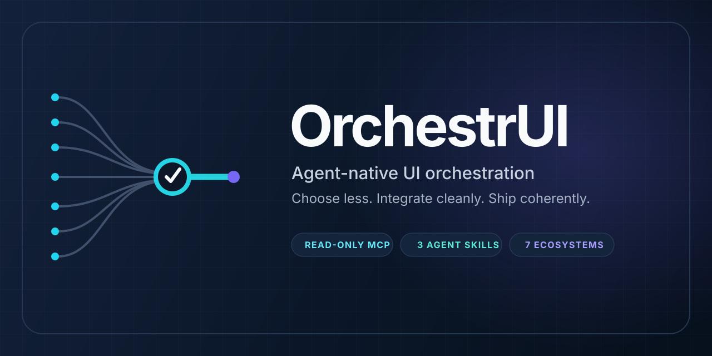
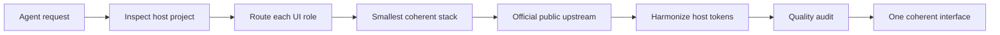

<p align="right">
  <a href="README.ru.md">Русская версия</a>
</p>

<div align="center">
  <a href="https://ecd5a.github.io/OrchestrUI/" title="Open the interactive OrchestrUI presentation">
    
  </a>

  <p><strong>Agent-native UI orchestration for modern frontend stacks.</strong><br><a href="https://ecd5a.github.io/OrchestrUI/">Open the interactive project presentation →</a></p>

  [](https://github.com/ECD5A/OrchestrUI/actions/workflows/ci.yml)
  [](LICENSE)
  [](.agents/skills)
  [](#seven-ecosystems)
  [](docs/MCP_SPEC.md)
</div>

OrchestrUI helps coding agents inspect an existing frontend, choose the smallest compatible set of UI tools, retrieve current public upstream guidance, and harmonize the result into one design language.

It is **not another component library**, a vendor bundle, or a shortcut for stacking seven design systems. Its value is the judgment between discovery and implementation.

## The problem it solves

More components do not automatically produce a better interface. Agents still need to decide which system owns base controls, charts, marketing polish, bespoke motion, and interactive graphics—without creating style conflicts, accessibility regressions, unnecessary dependencies, or licensing problems.

OrchestrUI makes those decisions explicit and testable.

## How it works



The system stays deliberately small:

- **Router skill** inspects the stack, assigns role ownership and records rejection decisions.
- **Orchestrator skill** retrieves only approved public pieces, harmonizes tokens and applies implementation gates.
- **Quality skill** audits the rendered UI for coherence, accessibility, responsiveness, motion and licensing.
- **Read-only MCP** exposes six bounded tools for catalog lookup, recommendations, discovery and plan auditing.
- **Catalog + adapters** keep exactly seven ecosystems, verified provenance and graceful live-registry fallback.

The governing rule is simple:

> **Do not use all seven. Use only the owners the target project actually needs.**

## Seven ecosystems

| Ecosystem | Primary role | Use it when… |
|---|---|---|
| **Kokonut UI** | selective product polish | a React/shadcn-compatible surface needs a refined component or micro-interaction |
| **React Bits** | signature creative effect | a hero or portfolio needs one distinctive text, background or canvas effect |
| **daisyUI** | optional semantic base | the project intentionally chooses a Tailwind component and theme system |
| **Bklit UI** | data visualization | dashboards need charts, gauges, heatmaps or financial visualization |
| **Anime.js** | bespoke motion engine | a timeline, SVG or scroll sequence exceeds CSS/component-native motion |
| **Rive** | interactive vector graphics | a licensed `.riv` asset and meaningful state-machine interaction are available |
| **Magic UI** | marketing enhancement | a landing page needs animated sections, backgrounds or visual accents |

All upstream projects remain independent. OrchestrUI is not affiliated with or endorsed by them.

## Decision examples

| Request | Recommended ownership | Deliberately rejected |
|---|---|---|
| Analytics dashboard on shadcn/ui | existing base + Bklit charts + optional Kokonut polish | daisyUI base conflict; broad decorative motion |
| Product landing page | Magic UI **or** Kokonut as primary enhancement; one React Bits signature effect if justified | overlapping marketing libraries; Anime.js for simple fades |
| Interactive product mascot | existing controls + Rive for the licensed state-machine asset | Rive for ordinary buttons/forms; unknown asset rights |
| Mature design system with no capability gap | keep the host system only | every new library |

More routing examples are in [`examples/router-plans.md`](examples/router-plans.md).

## Quick start

Requirements: Git and Node.js 20 or newer.

### 1. Clone and verify

```bash
git clone https://github.com/ECD5A/OrchestrUI.git
cd OrchestrUI
npm ci
npm run check
```

### 2. Install the agent skills

macOS/Linux:

```bash
bash scripts/install-codex.sh
```

Windows PowerShell:

```powershell
powershell -ExecutionPolicy Bypass -File scripts\install-codex.ps1
```

### 3. Use the workflow from a frontend project

```text
$ui-library-router plan the UI stack for this analytics dashboard.
$ui-orchestrator implement the approved plan.
$ui-quality-audit audit the finished UI.
```

The skills inspect the target project before selecting libraries. A valid answer may recommend no new OrchestrUI ecosystem.

## Codex and other agent hosts

- Repository workflows live in [`.agents/skills/`](.agents/skills/).
- Plugin-packaged copies live in [`skills/`](skills/) and are kept byte-for-byte synchronized by validation.
- The Codex plugin manifest is [`.codex-plugin/plugin.json`](.codex-plugin/plugin.json).
- Setup and MCP host configuration are documented in [`docs/SETUP.md`](docs/SETUP.md).
- Conservative Claude Code installation guidance is in [`docs/CLAUDE_CODE.md`](docs/CLAUDE_CODE.md).

## Read-only MCP and plugin

The stdio MCP server uses the stable Model Context Protocol TypeScript SDK v2. It exposes exactly six tools:

- `list_libraries` — list or filter the seven ecosystems.
- `recommend_stack` — recommend the smallest compatible ownership plan.
- `get_library_guidance` — return roles, integration, compatibility and legal guidance.
- `search_components` — search normalized public registry metadata with a verified fallback.
- `get_install_instructions` — return official install commands as inert text.
- `audit_plan` — flag base conflicts, rights issues and unresolved manual checks.

```bash
npm run build
npm run start:mcp
```

Bundled configuration is in [`.mcp.json`](.mcp.json). For another MCP host, configure a stdio server whose command is `node` and whose argument is the absolute path to `dist/mcp/src/server.js`.

`search_components` can access the official public registry indexes for Kokonut UI, React Bits, Bklit UI and Magic UI. Requests use an exact allowlist, reject non-public literal hosts and redirects, time out after four seconds, cap responses at 512 KiB, discard remote prose/files, derive display labels locally, and fall back to the bundled catalog. Every result marks component metadata as data only. Set `live: false` for deterministic offline results.

## Safety and legal boundaries

- MCP tools are read-only and non-destructive; no tool executes a shell, package manager or filesystem write.
- Install commands are advisory text and remain subject to the coding agent's normal permission model.
- React Bits is discovered and installed through official upstream paths; its component collection is never mirrored or redistributed by OrchestrUI.
- Paid, Pro, authenticated or credentialed upstream content is excluded.
- Rive runtime licensing and individual `.riv` artwork rights are reviewed separately.
- Remote registry content is treated as untrusted data and reduced to bounded metadata fields.

Read [`SECURITY.md`](SECURITY.md), [`docs/SECURITY_MODEL.md`](docs/SECURITY_MODEL.md), [`docs/LICENSING.md`](docs/LICENSING.md), and [`THIRD_PARTY.md`](THIRD_PARTY.md).

## Architecture

```text
OrchestrUI
├── AGENTS.md                  repository policy
├── .agents/skills/            reusable agent workflows
├── skills/                    plugin-packaged skill copies
├── catalog/                   routing, compatibility and provenance metadata
├── mcp/src/                   six-tool read-only MCP implementation
├── scripts/                   setup, validation and brand rendering
├── assets/                    original OrchestrUI brand system
└── docs/                      architecture, setup, security and release guidance
```

Read [`docs/ARCHITECTURE.md`](docs/ARCHITECTURE.md).

## Contributing and community

Focused contributions are welcome: upstream compatibility corrections, routing improvements, tests, accessibility/performance guidance, MCP hardening and documentation.

- Start with [`CONTRIBUTING.md`](CONTRIBUTING.md).
- Ask usage questions in GitHub Discussions once enabled; use Issues for reproducible bugs and scoped requests.
- Never disclose vulnerability details in a public issue; follow [`SECURITY.md`](SECURITY.md).
- Community expectations and project decision-making are documented in [`CODE_OF_CONDUCT.md`](CODE_OF_CONDUCT.md), [`SUPPORT.md`](SUPPORT.md), and [`GOVERNANCE.md`](GOVERNANCE.md).

## Roadmap

Version `0.1.0` includes the catalog, three skills, live metadata adapters, six-tool MCP server, plugin metadata, CI and release checks. Future work focuses on real adoption feedback, hosted distribution where appropriate, and API stability. See [`ROADMAP.md`](ROADMAP.md).

## Support OrchestrUI

OrchestrUI remains free and open source. Optional direct support helps maintain integrations, MCP compatibility, agent skills and documentation.

<div align="center">
  <p><strong>TON</strong><br><code>pointoncurve.ton</code></p>
  <p><strong>Bitcoin · BTC</strong><br><code>1ECDSA1b4d5TcZHtqNpcxmY8pBH1GgHntN</code></p>
  <p><strong>USDT · TRC20</strong><br><code>TUF4vPdB6QkjCvZq18rBL4Qj4dK5ihCN75</code></p>
</div>

Donations do not grant additional licensing rights, purchase priority, or create a support obligation.

## License and attribution

OrchestrUI's original code, documentation and brand artwork are released under the [MIT License](LICENSE). Third-party projects and assets remain subject to their own licenses and terms. See [`TRADEMARKS.md`](TRADEMARKS.md) for project-identity guidance.

Made and maintained by [ECD5A](https://github.com/ECD5A).

## Contact

For commercial integration, support, collaboration, and partnership inquiries:

<p>
  <a href="mailto:stelmak159@gmail.com" aria-label="Email"></a>
  &nbsp;
  <a href="https://t.me/ECDS4" aria-label="Telegram"></a>
  &nbsp;
  <a href="https://github.com/ECD5A/Memory-Genome-Engine" aria-label="GitHub repository"><picture><source media="(prefers-color-scheme: dark)" srcset="https://cdn.simpleicons.org/github/FFFFFF"></picture></a>
</p>

<div align="center">
  <strong>Build with more options. Ship with fewer conflicts.</strong>
</div>
