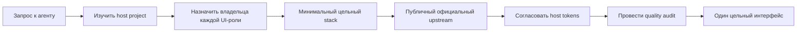

<p align="right">
  <a href="README.md">English version</a>
</p>

<div align="center">
  <a href="https://ecd5a.github.io/OrchestrUI/" title="Открыть интерактивную презентацию OrchestrUI">
    
  </a>

  <p><strong>Agent-native оркестрация UI для современных frontend-стеков.</strong><br><a href="https://ecd5a.github.io/OrchestrUI/">Открыть интерактивную презентацию проекта →</a></p>

  [](https://github.com/ECD5A/OrchestrUI/actions/workflows/ci.yml)
  [](LICENSE)
  [](.agents/skills)
  [](#семь-экосистем)
  [](docs/MCP_SPEC.md)
</div>

OrchestrUI помогает coding agents изучить существующий frontend, выбрать минимальный совместимый набор UI-инструментов, получить актуальные рекомендации из публичных upstream-источников и привести результат к единому визуальному языку.

Это **не ещё одна библиотека компонентов**, не vendor bundle и не способ бездумно сложить семь design systems. Ценность OrchestrUI — в решениях между discovery и implementation.

## Какую проблему решает OrchestrUI

Большое количество компонентов само по себе не делает интерфейс лучше. Агенту всё равно нужно определить, какая система отвечает за базовые controls, charts, marketing polish, bespoke motion и interactive graphics — без конфликтов стилей, ухудшения accessibility, ненужных dependencies и лицензионных рисков.

OrchestrUI делает эти решения явными и проверяемыми.

## Как это работает



Система намеренно остаётся небольшой:

- **Router skill** анализирует stack, назначает владельцев ролей и фиксирует обоснованные отказы.
- **Orchestrator skill** получает только одобренные публичные части, гармонизирует tokens и применяет implementation gates.
- **Quality skill** проверяет готовый UI: coherence, accessibility, responsiveness, motion и licensing.
- **Read-only MCP** предоставляет шесть ограниченных tools для catalog lookup, рекомендаций, discovery и plan audit.
- **Catalog + adapters** сохраняют ровно семь экосистем, проверенную provenance и fallback при недоступности live registry.

Главное правило:

> **Не использовать все семь. Выбирать только тех владельцев ролей, которые действительно нужны target project.**

## Семь экосистем

| Экосистема | Основная роль | Когда использовать |
|---|---|---|
| **Kokonut UI** | выборочный product polish | React/shadcn-compatible интерфейсу нужен качественный компонент или micro-interaction |
| **React Bits** | один выразительный creative effect | hero или portfolio нужен отличимый text, background или canvas effect |
| **daisyUI** | опциональная semantic base | проект осознанно выбирает Tailwind component и theme system |
| **Bklit UI** | data visualization | dashboard нужны charts, gauges, heatmaps или financial visualization |
| **Anime.js** | bespoke motion engine | timeline, SVG или scroll sequence не помещается в CSS/component-native motion |
| **Rive** | interactive vector graphics | есть лицензированный `.riv` asset и оправданная state-machine interaction |
| **Magic UI** | marketing enhancement | landing page нужны animated sections, backgrounds или visual accents |

Все upstream-проекты независимы. OrchestrUI не аффилирован с ними и не заявляет об их одобрении.

## Примеры маршрутизации

| Запрос | Рекомендуемое распределение ролей | Что намеренно исключается |
|---|---|---|
| Analytics dashboard на shadcn/ui | существующая base + Bklit charts + опциональный Kokonut polish | конфликтующая daisyUI base; лишний decorative motion |
| Product landing page | Magic UI **или** Kokonut как основной enhancement; один React Bits effect при необходимости | несколько конкурирующих marketing libraries; Anime.js для простых fades |
| Interactive product mascot | существующие controls + Rive для лицензированного state-machine asset | Rive для обычных buttons/forms; asset с неизвестными правами |
| Зрелая design system без функционального пробела | оставить только host system | все новые libraries |

Дополнительные примеры находятся в [`examples/router-plans.md`](examples/router-plans.md).

## Быстрый старт

Требования: Git и Node.js 20 или новее.

### 1. Клонировать и проверить

```bash
git clone https://github.com/ECD5A/OrchestrUI.git
cd OrchestrUI
npm ci
npm run check
```

### 2. Установить Agent Skills

macOS/Linux:

```bash
bash scripts/install-codex.sh
```

Windows PowerShell:

```powershell
powershell -ExecutionPolicy Bypass -File scripts\install-codex.ps1
```

### 3. Запустить workflow из frontend project

```text
$ui-library-router plan the UI stack for this analytics dashboard.
$ui-orchestrator implement the approved plan.
$ui-quality-audit audit the finished UI.
```

Skills сначала изучают target project и только потом выбирают libraries. Корректный результат может не добавлять ни одной экосистемы OrchestrUI.

## Codex и другие среды для агентов

- Repository workflows находятся в [`.agents/skills/`](.agents/skills/).
- Копии для plugin package находятся в [`skills/`](skills/) и проверяются на полное побайтовое соответствие.
- Codex plugin manifest: [`.codex-plugin/plugin.json`](.codex-plugin/plugin.json).
- Setup и конфигурация MCP hosts описаны в [`docs/SETUP.md`](docs/SETUP.md).
- Консервативная инструкция для Claude Code находится в [`docs/CLAUDE_CODE.md`](docs/CLAUDE_CODE.md).

## MCP только для чтения и plugin

Локальный stdio MCP server использует стабильный Model Context Protocol TypeScript SDK v2 и предоставляет ровно шесть tools:

- `list_libraries` — список и фильтрация семи экосистем.
- `recommend_stack` — минимальный совместимый ownership plan.
- `get_library_guidance` — roles, integration, compatibility и legal guidance.
- `search_components` — поиск нормализованных registry metadata с проверенным fallback.
- `get_install_instructions` — официальные install commands как неисполняемый текст.
- `audit_plan` — base conflicts, проблемы с правами и незакрытые manual checks.

```bash
npm run build
npm run start:mcp
```

Готовая конфигурация находится в [`.mcp.json`](.mcp.json). Для другого MCP host настройте stdio server с командой `node` и абсолютным путём к `dist/mcp/src/server.js` в качестве аргумента.

`search_components` может обращаться к публичным официальным registry indexes Kokonut UI, React Bits, Bklit UI и Magic UI. Используется точный allowlist; приватные literal hosts и redirects отклоняются; timeout составляет четыре секунды, максимальный ответ — 512 KiB. Remote prose и files отбрасываются, display labels формируются локально, а при ошибке используется bundled catalog. Каждый результат явно помечает component metadata как data, а не инструкции. Для детерминированной offline-работы задайте `live: false`.

## Безопасность и лицензионные границы

- MCP tools read-only и non-destructive: они не запускают shell, package manager и не записывают файлы.
- Install commands возвращаются как справочный текст; право на выполнение остаётся у permission model coding agent.
- React Bits обнаруживается и устанавливается только через официальный upstream; OrchestrUI никогда не зеркалирует и не распространяет его component collection.
- Paid, Pro, authenticated и credentialed upstream content исключён.
- Лицензия Rive runtime и права на конкретный `.riv` artwork проверяются отдельно.
- Remote registry content считается untrusted data и сокращается до ограниченных metadata fields.

Подробности: [`SECURITY.md`](SECURITY.md), [`docs/SECURITY_MODEL.md`](docs/SECURITY_MODEL.md), [`docs/LICENSING.md`](docs/LICENSING.md) и [`THIRD_PARTY.md`](THIRD_PARTY.md).

## Архитектура

```text
OrchestrUI
├── AGENTS.md                  repository policy
├── .agents/skills/            reusable agent workflows
├── skills/                    plugin-packaged skill copies
├── catalog/                   routing, compatibility и provenance metadata
├── mcp/src/                   реализация read-only MCP с шестью tools
├── scripts/                   setup, validation и brand rendering
├── assets/                    оригинальная brand system OrchestrUI
└── docs/                      architecture, setup, security и release guidance
```

Подробнее: [`docs/ARCHITECTURE.md`](docs/ARCHITECTURE.md).

## Участие в проекте и сообщество

Приветствуются сфокусированные contributions: исправления compatibility с upstream, улучшение routing, tests, accessibility/performance guidance, MCP hardening и documentation.

- Начните с [`CONTRIBUTING.md`](CONTRIBUTING.md).
- Вопросы по использованию можно задавать в GitHub Discussions после их включения; Issues предназначены для воспроизводимых bugs и ограниченных requests.
- Не публикуйте детали vulnerabilities в Issues — следуйте [`SECURITY.md`](SECURITY.md).
- Правила сообщества и принятия решений описаны в [`CODE_OF_CONDUCT.md`](CODE_OF_CONDUCT.md), [`SUPPORT.md`](SUPPORT.md) и [`GOVERNANCE.md`](GOVERNANCE.md).

## Планы развития

Версия `0.1.0` включает catalog, три Skills, live metadata adapters, MCP server с шестью tools, plugin metadata, CI и release checks. Дальнейшая работа будет опираться на реальный опыт использования, подходящие hosted distribution surfaces и стабилизацию API. См. [`ROADMAP.md`](ROADMAP.md).

## Поддержать OrchestrUI

OrchestrUI остаётся свободным open-source проектом. Добровольная прямая поддержка помогает сопровождать integrations, MCP compatibility, Agent Skills и documentation.

<div align="center">
  <p><strong>TON</strong><br><code>pointoncurve.ton</code></p>
  <p><strong>Bitcoin · BTC</strong><br><code>1ECDSA1b4d5TcZHtqNpcxmY8pBH1GgHntN</code></p>
  <p><strong>USDT · TRC20</strong><br><code>TUF4vPdB6QkjCvZq18rBL4Qj4dK5ihCN75</code></p>
</div>

Пожертвования не дают дополнительных лицензионных прав, приоритета разработки и обязательств по поддержке.

## Лицензия и сведения об авторстве

Оригинальный код, documentation и brand artwork OrchestrUI распространяются по [MIT License](LICENSE). Сторонние проекты и assets остаются под собственными лицензиями и условиями. Правила использования project identity описаны в [`TRADEMARKS.md`](TRADEMARKS.md).

Проект создан и поддерживается [ECD5A](https://github.com/ECD5A).

## Контакты

По вопросам коммерческой интеграции, поддержки, сотрудничества и партнёрства:

<p>
  <a href="mailto:stelmak159@gmail.com" aria-label="Email"></a>
  &nbsp;
  <a href="https://t.me/ECDS4" aria-label="Telegram"></a>
  &nbsp;
  <a href="https://github.com/ECD5A/Memory-Genome-Engine" aria-label="GitHub repository"><picture><source media="(prefers-color-scheme: dark)" srcset="https://cdn.simpleicons.org/github/FFFFFF"></picture></a>
</p>

<div align="center">
  <strong>Больше вариантов при разработке. Меньше конфликтов при выпуске.</strong>
</div>
