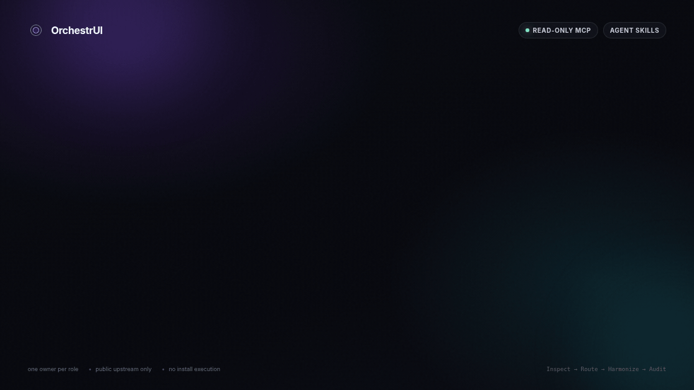

<p align="right">
  <a href="README.md">English version</a>
</p>

<div align="center">
  

  <p><strong>Детерминированные UI-политики и quality gates для coding agents.</strong></p>

  [](https://github.com/ECD5A/OrchestrUI/actions/workflows/ci.yml)
  [](LICENSE)
  [](.agents/skills)
  [](#экосистемы)
  [](docs/MCP_SPEC.md)

  <p>
    <a href="#quick-start">Быстрый старт</a>
    &nbsp;·&nbsp;
    <a href="#output">Результат</a>
    &nbsp;·&nbsp;
    <a href="#skills-and-mcp">Skills и MCP</a>
    &nbsp;·&nbsp;
    <a href="#ecosystems">Экосистемы</a>
    &nbsp;·&nbsp;
    <a href="docs/">Документация</a>
  </p>
</div>

OrchestrUI анализирует структурированный профиль проекта, сохраняет совместимых владельцев ролей и возвращает минимальную допустимую UI-композицию с обоснованием каждого решения.

<a id="quick-start"></a>
## Быстрый старт

Требуются Git и Node.js 20+.

```bash
git clone https://github.com/ECD5A/OrchestrUI.git
cd OrchestrUI
npm ci && npm run check
npm run benchmark
```

<details>
<summary><strong>Установить skills на macOS / Linux</strong></summary>

```bash
bash scripts/install-codex.sh
```

</details>

<details>
<summary><strong>Установить skills на Windows</strong></summary>

```powershell
powershell -ExecutionPolicy Bypass -File scripts\install-codex.ps1
```

</details>

Использовать из frontend-проекта:

```text
$ui-library-router подбери минимальный совместимый UI-стек.
$ui-orchestrator реализуй согласованный план.
$ui-quality-audit проверь готовый интерфейс.
```

<a id="output"></a>
## Что возвращает OrchestrUI

```json
{
  "input_mode": "structured-profiles",
  "selected": ["bklit-ui"],
  "owners": {
    "base-system": "host:shadcn-ui",
    "data-visualization": "bklit-ui"
  },
  "rejected": [{ "id": "daisyui", "rule": "base-system-conflict" }]
}
```

Routing benchmark в репозитории проходит **50/50** структурированных сценариев и три project fixtures в CI.

<a id="skills-and-mcp"></a>
## Skills и MCP

- `ui-library-router` — изучает host project и распределяет роли.
- `ui-orchestrator` — интегрирует одобренные части в единый визуальный язык.
- `ui-quality-audit` — проверяет coherence, accessibility, responsiveness, motion, performance и licensing.
- Read-only MCP — `list_libraries`, `recommend_stack`, `get_library_guidance`, `search_components`, `get_install_instructions` и `audit_plan`.

```bash
npm run build
npm run start:mcp
```

MCP-конфигурация находится в [`.mcp.json`](.mcp.json). Setup, architecture, security, licensing и contribution details находятся в [`docs/`](docs/), [`SECURITY.md`](SECURITY.md), [`THIRD_PARTY.md`](THIRD_PARTY.md) и [`CONTRIBUTING.md`](CONTRIBUTING.md).

MCP-интерфейс работает только на чтение и использует публичные upstream-метаданные; implementation code и сторонние assets остаются в host project.

<a id="ecosystems"></a>
## Экосистемы

| Экосистема | Роль |
|---|---|
| **Kokonut UI** | выборочный product polish для React/shadcn |
| **React Bits** | один выразительный creative effect |
| **daisyUI** | осознанная semantic base для Tailwind |
| **Bklit UI** | charts и data visualization |
| **Anime.js** | bespoke timeline, SVG или scroll motion |
| **Rive** | лицензированная interactive vector/state-machine графика |
| **Magic UI** | animated marketing enhancement |

OrchestrUI — независимый проект, не аффилированный и не одобренный перечисленными upstream-проектами.

## Поддержка

Если OrchestrUI полезен в вашей работе, вы можете поддержать его дальнейшее развитие:

* TON: `pointoncurve.ton`
* Bitcoin (BTC): `1ECDSA1b4d5TcZHtqNpcxmY8pBH1GgHntN`
* USDT (TRC20): `TUF4vPdB6QkjCvZq18rBL4Qj4dK5ihCN75`

## Контакты

По вопросам OrchestrUI, интеграции, консультаций или сотрудничества:

<p>
  <a href="mailto:stelmak159@gmail.com" aria-label="Email"></a>
  &nbsp;
  <a href="https://t.me/ECDS4" aria-label="Telegram"></a>
  &nbsp;
  <a href="https://github.com/ECD5A/OrchestrUI" aria-label="GitHub repository"><picture><source media="(prefers-color-scheme: dark)" srcset="https://cdn.simpleicons.org/github/FFFFFF"></picture></a>
</p>
